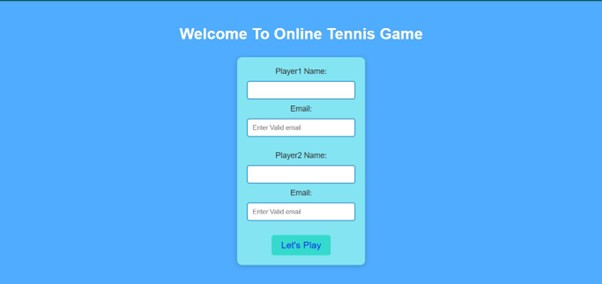
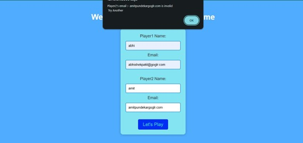
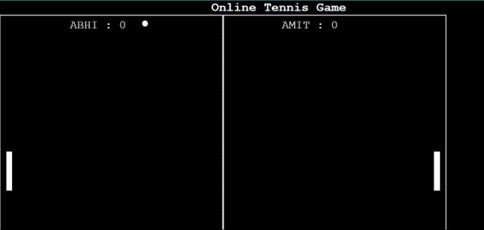
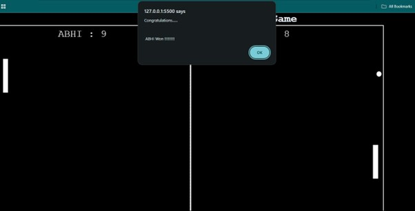

<div align="center">

# 🎾 Online Tennis Game / Pong Game

### A Two-Player Browser-Based Pong/Tennis Game built with HTML, CSS & JavaScript


<br/>

---

</div>

## 📸 Screenshots

<div align="center">

### 🏠 Registration / Home Page


### ❌ Email Validation Error


### 🎮 Game Page


### 🏆 Score / Winner Page


</div>

---

## 📋 Table of Contents

- [About the Project](#-about-the-project)
- [Features](#-features)
- [How to Play](#-how-to-play)
- [Project Structure](#-project-structure)
- [Technologies Used](#-technologies-used)
- [Getting Started](#-getting-started)

---

## 🧠 About the Project

**Online Tennis Game** is a browser-based two-player paddle game (inspired by classic Pong) developed as a micro project for the **Client Side Scripting Language (22519)** course.

The game features:
- A **registration page** where two players enter their names and email IDs
- Real-time **email validation** using Regular Expressions
- **Cookie-based storage** of player data
- A fully interactive **tennis/pong game** where two players compete to reach 10 points
- Dynamic **scoreboard** displaying player names and live scores
- **Keyboard-controlled paddles** for both players

This project showcases the power of vanilla HTML, CSS, and JavaScript in building fun, interactive, and responsive browser games — no frameworks, no libraries.

---

## ✨ Features

| Feature | Description |
|---|---|
| 🧾 Player Registration | Two players register with name + email before the game starts |
| ✅ Email Validation | Regex-based real-time validation of both email IDs |
| 🍪 Cookie Handling | Player emails stored securely in browser cookies (24hr expiry) |
| 🏓 Real-Time Gameplay | Smooth ball and paddle movement using `requestAnimationFrame` |
| 🎯 Collision Detection | Accurate ball-paddle collision logic |
| 📊 Live Scoreboard | Score updates instantly with player names |
| 🏆 Win Detection | Game ends at 10 points — winner announced via alert |
| 🔁 Auto Reset | Game reloads automatically after a winner is declared |
| ⌨️ Keyboard Controls | W/S keys for Player 1, Arrow Up/Down for Player 2 |

---

## 🎮 How to Play

```
Player 1 Controls:          Player 2 Controls:
  W  → Move Paddle Up         ↑  → Move Paddle Up
  S  → Move Paddle Down       ↓  → Move Paddle Down
```

1. Open `Registration.html` in your browser
2. Enter **Player 1** and **Player 2** names and valid email IDs
3. Click **"Let's Play"** — the game window opens automatically
4. Use keyboard controls to move your paddle and deflect the ball
5. First player to score **10 points** wins! 🎉

---

## 📁 Project Structure

```
Online-Tennis-Game/
│
├── 📄 Registration.html     # Player registration form with validation
├── 📄 Game.html             # Main game interface (pong field + scoreboard)
├── 🎨 style1.css            # Stylesheet for the game canvas and elements
├── ⚙️  js_3.js              # Core game logic (ball, paddles, scoring)
│
└── 📂 screenshots/
    ├── home_page.png
    ├── error_page.png
    ├── game_page.png
    └── score_page.png
```

---

## 🛠️ Technologies Used

- **HTML5** — Structure and layout of both pages
- **CSS3** — Styling, positioning, and visual design of game elements
- **JavaScript (Vanilla)** — Game logic, DOM manipulation, event handling, cookies, regex validation
- **Browser APIs** — `requestAnimationFrame`, `getBoundingClientRect`, `document.cookie`, `window.open`

---

## 🚀 Getting Started

No installation or server required! This is a pure client-side project.

### Steps to Run Locally:

```bash
# 1. Clone the repository
git clone https://github.com/YOUR_USERNAME/Online-Tennis-Game.git

# 2. Navigate into the project folder
cd Online-Tennis-Game

# 3. Open the registration page in your browser
# Simply double-click Registration.html  OR  use Live Server in VS Code
```

> ⚠️ **Note:** The game uses `window.opener` to read player names from the registration window. Make sure to open `Registration.html` first and let it open `Game.html` automatically by clicking **"Let's Play"**.

---

<div align="center">

Made with ❤️ by Abhishek Patil | Academic Year 2024–25

</div>
